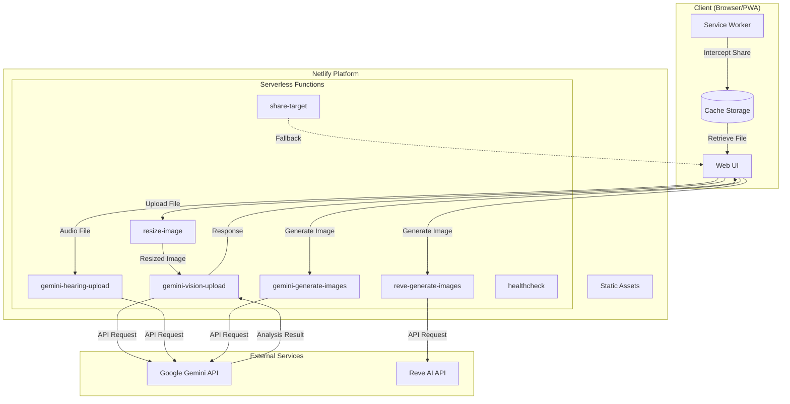
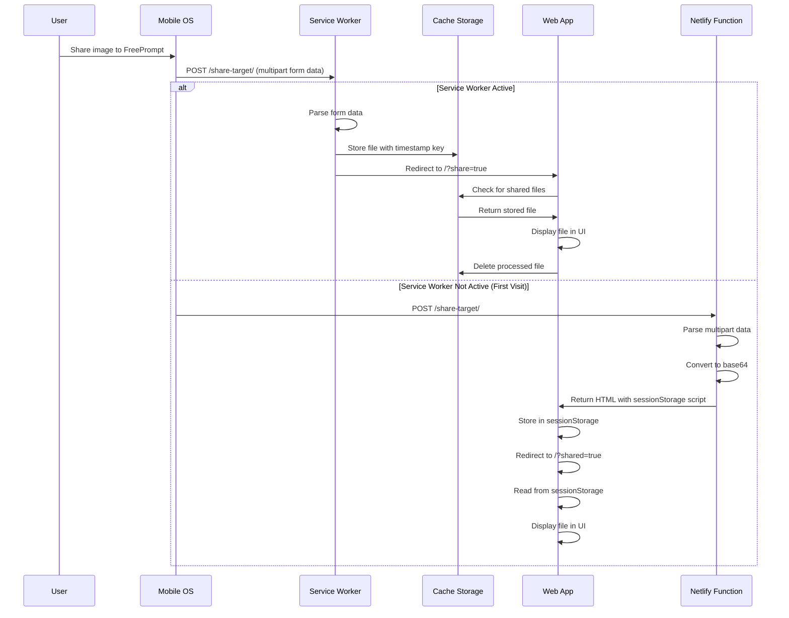
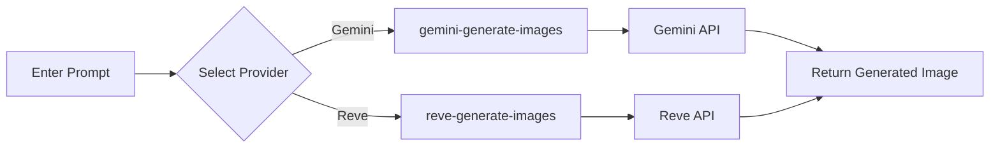
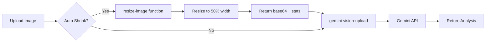

# freeprompt 🚀

A hassle-free Progressive Web App (PWA) to test LLM API for free with media classification capabilities.

[](https://app.netlify.com/sites/freeprompt/deploys)

[Live Demo](https://freeprompt.netlify.app/)⚡

## Features ✨

- **Image Classification**: Upload images and get AI-powered classification using Gemini API
- **Audio Transcription**: Transcribe and translate audio files
- **Image Generation**: Generate images using Gemini AI or Reve AI
- **PWA Support**: Install as a native app on mobile and desktop
- **Web Share Target**: Share images directly from your gallery or other apps
- **Auto Image Resize**: Automatic image optimization before analysis
- **Multiple AI Models**: Choose from various Gemini models based on speed/quality needs

## Image Classification with Gen AI (Gemini)

Upload a file (limited to 4MB in size) and get a classification of it. The prompt adopts [few-shots technique](https://www.promptingguide.ai/techniques/fewshot).


## Why These AI Services? 🤖

### Gemini AI
Because compared to other LLMs in the market, it still provides API access without any payment method setup. There are naturally limitations, but if you want to start testing GenAI API integration, this is a possible method.

### Reve AI
[Reve AI](https://reve.ai/) is an alternative image generation service that provides high-quality AI-generated images. It's integrated as an additional option for image generation alongside Gemini.

The implementation is totally TypeScript-based. To have secure access to the APIs, a [BFF](https://en.wikipedia.org/wiki/Frontend_and_backend#Software_definitions) adopting Netlify serverless functions is used. Why Netlify and their serverless functions? Because they are free and easy to set up.

## Architecture Overview 🏗️



## Web Share Target Flow 📤

The app can receive shared files from other apps on your device (e.g., sharing an image from your gallery).



### How Share Target Works

1. **Manifest Configuration** (`manifest.json`):
   ```json
   {
     "share_target": {
       "action": "/share-target/",
       "method": "POST",
       "enctype": "multipart/form-data",
       "params": {
         "files": [{ "name": "photos", "accept": ["image/*", "audio/*"] }]
       }
     }
   }
   ```

2. **Service Worker** (`assets/service-worker.js`):
   - Intercepts POST requests to `/share-target/`
   - Extracts file from form data
   - Stores in Cache Storage with unique key
   - Redirects to app with `?share=true` parameter

3. **Netlify Function Fallback** (`netlify/functions/share-target.ts`):
   - Handles share when Service Worker isn't active (first visit)
   - Parses multipart form data
   - Converts to base64 and stores in sessionStorage via embedded script

4. **App Loading** (`src/main.ts`):
   - Detects `?share=true` or `?shared=true` in URL
   - Checks sessionStorage first (Netlify function path)
   - Then checks Cache Storage (Service Worker path)
   - Loads file into the analysis UI

## Image Generation 🎨

Generate images using AI with two available providers:

### Gemini AI Image Generation
Uses Google's Gemini models capable of generating images from text prompts.

### Reve AI Image Generation
Alternative image generation using [Reve AI](https://reve.ai/) API for high-quality image creation.



## Image Resize and Upload Flow



The resize function returns:
```json
{
    "resizedImage": "<base64 string>",
    "imageStats": {
        "originalSize": 12345,
        "resizedSize": 6789,
        "originalWidth": 4080,
        "originalHeight": 1840,
        "resizedWidth": 2040,
        "resizedHeight": 920
    }
}
```

## Requirements 📋

- [Volta](https://volta.sh/) (Node.js version manager)
- A Google Account
- Google API Key for Gemini AI (https://ai.google.dev/)
- Netlify Account (https://app.netlify.com/)
- Netlify CLI (https://docs.netlify.com/cli/get-started/)

## Setup 🛠️

1. Install dependencies:
   ```sh
   yarn
   ```

2. Create `.env` file with your API keys:
   ```sh
   # Required for image/audio analysis
   NETLIFY_GOOGLE_API_KEY=your_gemini_api_key_here
   
   # Optional: for Reve AI image generation
   NETLIFY_REVE_API_KEY=your_reve_api_key_here
   ```

3. Create a new website on Netlify:
   ```sh
   netlify init
   ```

## Running Locally 🏠

Development mode (without serverless functions):
```sh
yarn dev
```

Full local environment with Netlify functions:
```sh
yarn start
```

## Deploying to Production 🚀

```sh
yarn deploy
```

## Debug Mode 🐛

Enable debug panels and verbose logging for development:

1. Add to your `.env` file:
   ```
   VITE_ENABLE_DEBUG=true
   ```

2. Rebuild the app

This enables:
- On-screen debug panel showing share target flow
- Console logging for all share-related operations
- Service Worker status indicators

## Available Models

| Model | Average Time |
|-------|-------------|
| gemini-2.5-pro | 13.530s |
| gemini-2.5-flash | 8.115s |
| gemini-2.5-flash-lite | 2.189s |
| gemini-2.0-flash | 3.024s |
| gemini-2.0-flash-lite | 3.530s |
| gemini-1.5-flash | 3.703s |
| gemini-1.5-flash-8b | 3.203s |

## Project Structure 📁

```
freeprompt/
├── assets/
│   └── service-worker.js    # PWA service worker with share target handling
├── netlify/
│   └── functions/           # Serverless functions
│       ├── gemini-vision-upload.ts   # Image analysis
│       ├── gemini-hearing-upload.ts  # Audio transcription
│       ├── gemini-generate-images.ts # Image generation (Gemini)
│       ├── reve-generate-images.ts   # Image generation (Reve AI)
│       ├── resize-image.ts           # Image preprocessing
│       └── share-target.ts           # Share target fallback
├── src/
│   ├── components/          # UI components
│   ├── utils/
│   │   ├── debug.ts         # Debug configuration
│   │   └── debug-panel.ts   # Mobile debug panel
│   ├── main.ts              # App entry point + share handling
│   └── setup.ts             # Event handlers + API calls
├── manifest.json            # PWA manifest with share_target
└── netlify.toml             # Netlify configuration
```

## Testing Share Target

1. Deploy to Netlify or use `netlify dev` with HTTPS tunnel
2. Install the PWA on your mobile device
3. Open your gallery and share an image
4. Select "FreePrompt" from the share menu
5. The image should appear in the analysis UI

## Recent Improvements

- **PWA Share Target**: Share images directly from your device's gallery
- **Service Worker Caching**: Efficient offline support and share handling
- **Debug Feature Flag**: Toggle debug UI with `VITE_ENABLE_DEBUG`
- **Improved Error Handling**: Better error messages and graceful fallbacks
- **Content Hash Caching**: Proper cache invalidation with hashed asset filenames

## License

MIT
