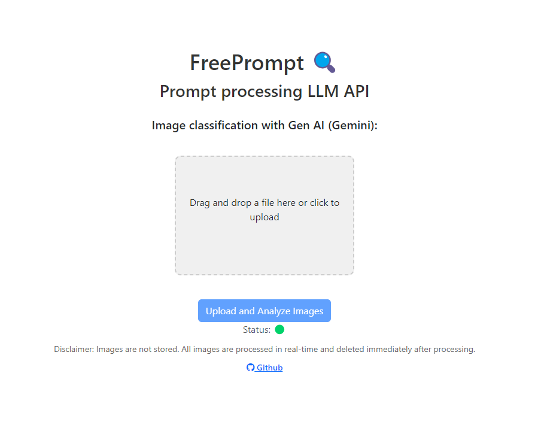
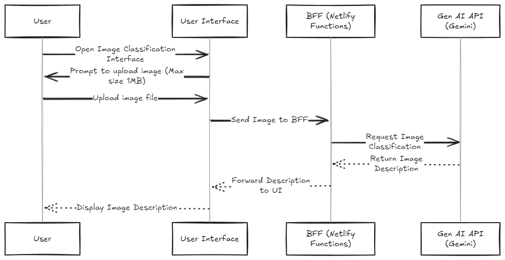

# freeprompt 🚀

A hassle-free setup to test LLM API for free

[](https://app.netlify.com/sites/freeprompt/deploys)

[Live Demo ⚡](https://freeprompt.netlify.app/)

## Image classification with Gen AI (Gemini):

Is it possible to upload a file (limited to 1MB in size) and get a classification of it. The prompt adopts [few-shots technique](https://www.promptingguide.ai/techniques/fewshot).



## Why Gemini AI? 🤖
Because compared to other LLMs in the market, it still provides API access without any payment method setup. There are naturally limitations, but if you want to start testing GenAI API integration, this is a possible method.

The implementation is totally TypeScript-based. To have secure access to the API, a [BFF](https://en.wikipedia.org/wiki/Frontend_and_backend#Software_definitions) adopting Netlify serverless functions is used.
Why Netlify and their serverless functions? Because again, they are free and easy to set up.



## Requirements 📋

- [Volta](https://volta.sh/)
- A Google Account
- Google API Key for Gemini AI (https://ai.google.dev/ and https://aistudio.google.com/apikey)
- Netlify Account (https://app.netlify.com/)
- Netlify CLI (https://docs.netlify.com/cli/get-started/)

## Setup 🛠️

1. Install dependencies:
    ```sh
    yarn
    ```

2. Create a new website on Netlify:
    ```sh
    netlify init
    ```
    Connect to the above-created website.

## Running Locally 🏠

To run the webapp locally (but without the serverless functions):
```sh
yarn dev
```

To run the webapp without the serverless functions enabled (this starts netlify locally)
```sh
yarn start
```


## Deploying to Production 🚀

To deploy a production build to Netlify Website:
```sh
yarn deploy
```


## Available Models and avereage executiontime (Tested)

- models/gemini-2.5-pro Time: 13.530 seconds
- models/gemini-2.5-flash Time: 8.115 seconds
- models/gemini-2.5-flash-lite Time: 2.189 seconds
- models/gemini-2.0-flash Time: 3.024 seconds
- models/gemini-2.0-flash-lite Time: 3.530 seconds
- models/gemini-2.0-flash-lite-preview-02-05 Time: 3.332 seconds
- models/gemini-1.5-flash Time: 3.703 seconds
- models/gemini-1.5-flash-8b Time: 3.203 seconds

## Image resize and upload flow (client + Netlify functions)

This project includes a small image preprocessing flow to make Vision uploads reliable and fast:

- The client reads the uploaded file and sends a base64 payload to the Netlify function `/functions/resize-image`.
- `resize-image` returns JSON with this shape on success:

```json
{
    "resizedImage": "<base64 string>",
    "imageStats": {
        "originalSize": 12345,
        "resizedSize": 6789,
        "originalWidth": 4080,
        "originalHeight": 1840,
        "originalAspectRatio": 2.22,
        "resizedWidth": 2040,
        "resizedHeight": 920,
        "resizedAspectRatio": 2.22
    }
}
```

- By default the server resizes images to 50% of the original width (with `withoutEnlargement: true`). If the original width is not available, it falls back to 1024px.
- The UI includes an `Auto shrink image` toggle (default: enabled). When disabled, the client skips resize and sends the original image to the analysis function; the client also populates `imageStats` by loading the original image to extract width/height.

## Quick test

1. Start Netlify dev (or your preferred dev server):
```powershell
ntl dev
```

2. Upload an image using the UI. Toggle `Auto shrink image` to test both paths.

3. To test the resize function manually with curl, create a `payload.json` with `{"data": "<base64 image>"}` and run:
```powershell
curl -X POST -H "Content-Type: application/json" -d @payload.json http://localhost:8888/.netlify/functions/resize-image
```

The function will return the JSON documented above.


## Recent Improvements

-   **Enhanced Image Generation Parsing**: Improved the parsing logic for Gemini API responses in image generation, ensuring accurate extraction of title, description, and dataUri.
-   **Robust Unit Testing**: Fixed and improved unit tests for image analysis and utility functions, ensuring better code quality and reliability.
-   **UI Event Handling Fix**: Resolved an issue where image generation was triggered multiple times in the user interface, providing a smoother user experience.